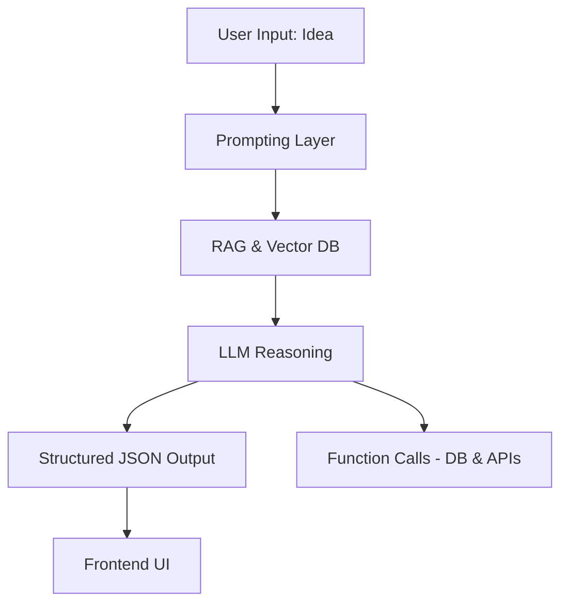

# 🚀 InnoPilot – Your AI Co-Pilot for Innovation

*“Navigate your idea from spark to success.”*

---

## 📌 Project Overview

InnoPilot is an AI-powered **innovation co-pilot** designed to help **students, early-stage founders, entrepreneurs, and creators** take their ideas from spark to execution.

The system helps users:

* Validate their **startup or project ideas**
* Research and analyze **competitors** in real-time
* Generate **step-by-step execution roadmaps**

By combining **Large Language Models (LLMs)** with **retrieval, structured reasoning, and function calling**, InnoPilot acts as a **one-stop assistant** for the early stages of innovation.

---

## 🎯 Problem Statement

Many innovators face these challenges:

* ❓ *Is my idea actually good?*
* 🏢 *Who else is already doing this?*
* 🛠️ *What’s the best way to build and execute it?*

Existing tools like **Notion AI** or **basic idea validators** solve only one part of the puzzle.
👉 InnoPilot uniquely solves **all three together** — validation + competitor insights + execution roadmap.

---

## 🧠 Core AI/LLM Concepts in InnoPilot

### 1. **Prompting**

* Zero-shot, One-shot, Multi-shot prompting
* Chain of Thought reasoning
* Dynamic prompting (adaptive to context)

<details>
<summary>Example Prompt</summary>

```
User: "I want to build an app where students can swap books."  

AI (Chain of Thought reasoning):  
Step 1: Identify target users (students)  
Step 2: Define value (affordable book exchange)  
Step 3: Compare with existing apps (Amazon, OLX, BookScouter)  
Step 4: Output structured idea validation  
```

</details>  

---

### 2. **Retrieval-Augmented Generation (RAG)**

* Store **competitor data and idea descriptions** as **embeddings** in a vector database
* Perform **similarity search** to find competitors
* Combine **retrieved knowledge + reasoning** for validation

<details>
<summary>Example RAG Flow</summary>

1. User enters: *"AI-powered diet planner"*
2. System retrieves competitors → *"Noom, MyFitnessPal"*
3. AI outputs structured validation JSON

```json
{
  "validation": "Feasible – growing demand for personalized diet apps",
  "competitors": ["Noom", "MyFitnessPal"],
  "roadmap": [
    "Market Research",
    "MVP with AI recommendations",
    "Mobile app launch"
  ]
}
```

</details>  

---

### 3. **Structured Output**

AI always returns clean **JSON outputs** → easy to use in UI.

```json
{
  "validation": "Strong Idea – Students want affordable books",
  "competitors": ["Amazon", "OLX", "BookScouter"],
  "roadmap": ["Build prototype", "Test with 20 students", "Launch app"]
}
```

---

### 4. **Function Calling**

The AI can **trigger backend functions** to take real-world actions.

#### Example Functions:

**1. Save Idea**
Store user ideas in the database for later tracking.

```json
{
  "name": "save_idea",
  "arguments": {
    "idea_title": "AI Diet Planner",
    "category": "Health & Fitness",
    "description": "AI-driven personalized meal and fitness plans",
    "user_id": "12345"
  }
}
```

**2. Fetch Competitors**
Retrieve competitor insights from the vector DB + APIs.

```json
{
  "name": "fetch_competitors",
  "arguments": {
    "idea_title": "AI Diet Planner",
    "category": "Health & Fitness",
    "limit": 5
  }
}
```

**3. Generate Roadmap**
Generate a structured execution roadmap with milestones.

```json
{
  "name": "generate_roadmap",
  "arguments": {
    "idea_id": "67890",
    "timeframe": "6 months",
    "granularity": "monthly"
  }
}
```

⚡ These three functions show that InnoPilot is **not just analysis**, but a system that can **act, store, and generate actionable outputs**.

---

## 🔬 Similarity Functions

We implement multiple similarity measures for embeddings:

* Cosine Similarity → Semantic similarity
* Dot Product → Raw score
* Euclidean Distance → Distance-based similarity

These power **vector DB searches**.

---

## 🖼️ System Architecture



---

## 🎨 UI/UX Design (Planned)

* **Idea Input Box** → User types their idea
* **Competitor Dashboard** → List of competitors with strengths/weaknesses
* **Execution Roadmap Cards** → Timeline view with milestones
* **Save/Share Button** → Export reports or save idea

---

## 📅 Project Timeline

| Day        | Focus Area                              | Concepts / Tasks                          | Deliverable         |
| ---------- | --------------------------------------- | ----------------------------------------- | ------------------- |
| **Day 1**  | 📖 Setup & Documentation                | Repo + README                             | ✅ README.md         |
| **Day 2**  | 📝 Prompting Basics                     | Zero/One/Multi-shot, system prompts       | ✅ Prompt examples   |
| **Day 3**  | 🔄 Advanced Prompting                   | Chain of Thought, Dynamic prompts         | ✅ Prompt files      |
| **Day 4**  | 🔢 Similarity Functions                 | Cosine, Dot, Euclidean                    | ✅ Functions + tests |
| **Day 5**  | 📊 Embeddings                           | Generate + explain embeddings             | ✅ Embedding script  |
| **Day 6**  | 📂 Vector Database (RAG)                | Pinecone/FAISS integration                | ✅ Vector DB setup   |
| **Day 7**  | ⚡ Structured Outputs & Function Calling | JSON outputs + DB function calls          | ✅ AI+DB link        |
| **Day 8**  | 🎛️ AI Parameters                       | Tune temperature, Top-K/P, token logging  | ✅ Config updates    |
| **Day 9**  | ✅ Evaluation Framework                  | Dataset + judge prompts + automated tests | ✅ Eval script       |
| **Day 10** | 🚀 Final Integration                    | Connect frontend & backend → MVP          | ✅ Working demo      |

---

## 📊 Evaluation / Success Metrics

* **Accuracy**: % of correct idea validations compared to human benchmark
* **Competitor Recall**: % of relevant competitors retrieved
* **User Testing**: Feedback from 10+ student founders & creators
* **Execution Roadmap Usability**: Rated via survey (1–5 scale)

---

## 🛠 Tech Stack

| Layer          | Technology Used                                 |
| -------------- | ----------------------------------------------- |
| **Frontend**   | React.js, Tailwind CSS, Chart.js                |
| **Backend**    | Node.js, Express.js                             |
| **Database**   | MongoDB Atlas, Vector DB (Pinecone/Weaviate)    |
| **AI Layer**   | OpenAI GPT-4o-mini, LangChain                   |
| **APIs**       | Google Trends, News API, USPTO, GitHub REST API |
| **Deployment** | Vercel (Frontend), Render (Backend)             |

---

## 🎯 Why InnoPilot?

Unlike existing tools, InnoPilot uniquely combines:
✅ Idea Validation + Competitor Research + Roadmap Execution
✅ Demonstrates **key AI/LLM concepts** (prompting, RAG, JSON output, function calling)
✅ Balanced: **academically strong** + **practically useful**

---